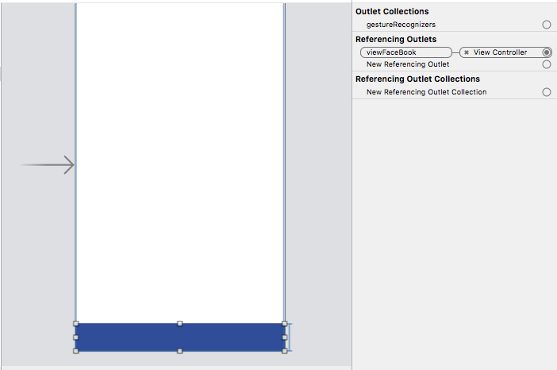

# LoginHelperForFacebook-iOS
Facebook 회원가입의 편리성을 위해 만들어진 Login Helper 입니다.

#  FACEBOOK LOGIN

Facebook 로그인을 보다 간편하게 만들 수 있도록 구성하였습니다.

## 필요사항

1. [페이스북 앱 생성](https://developers.facebook.com/)
2. *FACEBOOK_APP_KEY* Xcode 프로젝트에 등록

## 사용 방법

1. 페이스북 버튼을 표시할 `UIView` 을 OutLet 변수로 연결합니다.
   

2. `actionSigninButton()` 을 호출 하여 로그인한 페이스북 로그인 설정을 합니다.

   ```swift
   @IBOutlet weak var viewFaceBook: UIView!
   
   /// Facebook 로그인 설정
   func initFB(){
       let btnFaceBook = KFBLoginButton(frame: CGRect(x: 0, y: 0, width: viewFaceBook.frame.width, height: viewFaceBook.frame.height))
       btnFaceBook.actionSigninButton(fbInfo: self)
       if btnFaceBook.checkRequest(){
           print("[LoginModule] Login")
       }else{
           print("[LoginModule] Log Out")
       }
       viewFaceBook.addSubview(btnFaceBook)
   }
   ```

3. `KFBInfoDelegate` 을 delegate로 연결하여 로그인 한 후에 회원 정보를 가져옵니다.

   ```swift
   /// 페이스북 로그인 후 정보가 전달됩니다.
   ///
   /// - Parameters:
   ///   - connection: 연결 유무
   ///   - result: 고객 정보 리턴
   ///   - error: 에러 메시지
   func kFBInfoCompletionHandler(_ connection: FBSDKGraphRequestConnection?, _ result: Any, _ error: Error?) {
       if (error == nil){
           let dict = result as! [String : AnyObject]
           //print(result!)
           print(dict)
           let facebookEmail = dict["email"] as! String
           let facebookId = dict["id"] as! String
           print("[LoginModule] email = \(facebookEmail)")
           print("[LoginModule] id = \(facebookId)")
           print("[LoginModule] name = \( dict["name"] as! String)")
       }
   }
   ```
